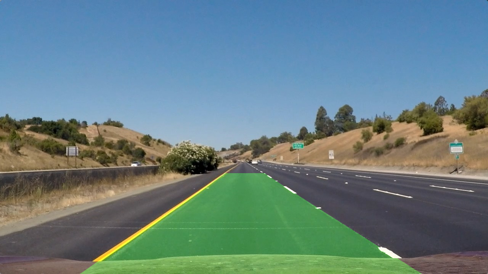

##Advanced Lane Finding

---

###Overview

The goal of this project is to identify lane lines from road mages taking from camera using tradictional computer vision techniques. The steps to identify lane lines from image are the following:

* Compute the camera calibration matrix and distortion coefficients given a set of chessboard images.
* Apply a distortion correction to raw images.
* Use color transforms, gradients, etc., to create a thresholded binary image.
* Apply a perspective transform to rectify binary image ("birds-eye view").
* Detect lane pixels and fit to find the lane boundary.
* Determine the curvature of the lane and vehicle position with respect to center.
* Warp the detected lane boundaries back onto the original image.
* Output visual display of the lane boundaries and numerical estimation of lane curvature and vehicle position.

We'll describe each step in detail next.

---

###Camera Calibration

The code for this step is contained in the function **'camera_cal'** in the **main.py**. 

I start by preparing "object points", which will be the (x, y, z) coordinates of the chessboard corners in the world. Here I am assuming the chessboard is fixed on the (x, y) plane at z=0, such that the object points are the same for each calibration image.  Thus, `objp` is just a replicated array of coordinates, and `objpoints` will be appended with a copy of it every time I successfully detect all chessboard corners in a test image.  `imgpoints` will be appended with the (x, y) pixel position of each of the corners in the image plane with each successful chessboard detection.  

I then used the output `objpoints` and `imgpoints` to compute the camera calibration and distortion coefficients using the `cv2.calibrateCamera()` function.  I applied this distortion correction to the test image using the `cv2.undistort()` function and obtained this result: 

Distorted Chessboard | Undistorted Chessboard
---------------------|-----------------------
 | 

Following images show the a test image and the image after distortion correction:

Distorted Road Image | Undistorted Road Image
---------------------|-----------------------
 | 

###Thresholded Binary Image

In this step we tried to find lane lines using edge detection techniques. It is crucial to be able to identify lane lines pixels. I used a combination of color and gradient thresholds to generate a binary image. The code is contained in the function **'hsv_pipeline'** in main.py. Following illustrates the step of image thresholding:

* Apply Sobel operation in X direction with threshold (20, 150)
* Calculate gradient and apply threshold (0.7, 1.2)
* Threshold S channel (170, 255) in HLS color space
* Threahold L channel (30, 255) in HLS color space

Here is an example of my ouput for this step:

Road Image | Thresholded Binary Image
-----------|-------------------------
 | 

###Perspective Transform

The code for my perspective transform 'transform' is encapsulated in **'Perspective_xform'** class in the 'main.py' file. I chose the hardcode the source and destination points for transform. I manually picked those points from sample image and assume the image size to be 720x1280. Following lists the source and destination points:

| Source        | Destination   | 
|:-------------:|:-------------:| 
| 255, 690      | 305, 690      | 
| 1060, 690     | 1010, 690     |
| 585, 455      | 305, 0        |
| 700, 455      | 1010, 0       |

I verified that my perspective transform was working as expected by drawing the `src` and `dst` points onto a test image and its warped counterpart to verify that the lines appear parallel in the warped image.

Road Image | Warped Image
-----------|--------------
 | 

###Lane Lines Detection

After performing perspective transform on the binary image, our next step is to identify the lane lines from the image. 

Then I did some other stuff and fit my lane lines with a 2nd order polynomial kinda like this:

####5. Describe how (and identify where in your code) you calculated the radius of curvature of the lane and the position of the vehicle with respect to center.

I did this in lines # through # in my code in `my_other_file.py`

####6. Provide an example image of your result plotted back down onto the road such that the lane area is identified clearly.

I implemented this step in lines # through # in my code in `yet_another_file.py` in the function `map_lane()`.  Here is an example of my result on a test image:

---

###Pipeline (video)

####1. Provide a link to your final video output.  Your pipeline should perform reasonably well on the entire project video (wobbly lines are ok but no catastrophic failures that would cause the car to drive off the road!).

    

---

###Discussion

####1. Briefly discuss any problems / issues you faced in your implementation of this project.  Where will your pipeline likely fail?  What could you do to make it more robust?

Here I'll talk about the approach I took, what techniques I used, what worked and why, where the pipeline might fail and how I might improve it if I were going to pursue this project further.  

