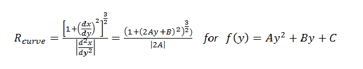

##Advanced Lane Finding

---

###Overview

The goal of this project is to identify lane lines from road images using traditional computer vision techniques. Following are the steps to identify lane lines from image:

* Compute the camera calibration matrix and distortion coefficients given a set of chessboard images.
* Apply a distortion correction to raw images.
* Use color transforms, gradients, etc., to create a thresholded binary image.
* Apply a perspective transform to rectify binary image ("birds-eye view").
* Detect lane pixels and fit to find the lane lines.
* Determine the curvature of the lane and vehicle position with respect to center.
* Warp the detected lane boundaries back onto the original image.
* Output visual display of the lane boundaries and numerical estimation of lane curvature and vehicle position.

We'll describe each step in detail next sections.

---

###Camera Calibration

The code for this step is contained in the function **`camera_cal`** in the **main.py** file. 

I start by preparing "object points", which will be the (x, y, z) coordinates of the chessboard corners in the world. Here I am assuming the chessboard is fixed on the (x, y) plane at z=0, such that the object points are the same for each calibration image.  Thus, `objp` is just a replicated array of coordinates, and `objpoints` will be appended with a copy of it every time I successfully detect all chessboard corners in a test image.  `imgpoints` will be appended with the (x, y) pixel position of each of the corners in the image plane with each successful chessboard detection.  

I then used the output `objpoints` and `imgpoints` to compute the camera calibration and distortion coefficients using the `cv2.calibrateCamera()` function.  I applied this distortion correction to the test image using the `cv2.undistort()` function and obtained this result: 

Distorted Chessboard | Undistorted Chessboard
---------------------|-----------------------
 | 

Following images show a test image and the image after distortion correction:

Distorted Road Image | Undistorted Road Image
---------------------|-----------------------
 | 

###Thresholded Binary Image

In this step, we tried to filter the image using edge detection techniques to identify lane pixels. It is a crucial step for this project. I used a combination of color and gradient thresholds to generate a binary image. The code is contained in the function **`hsv_pipeline`** in **main.py**. Following illustrates the step of image thresholding:

* Apply Sobel operation in X direction with threshold (20, 150)
* Calculate gradient direction and apply threshold (0.7, 1.2)
* Threshold S channel (170, 255) in HLS color space
* Threahold L channel (30, 255) in HLS color space

Here is an example of an ouput image and its original image from this step:

Road Image | Thresholded Binary Image
-----------|-------------------------
 | 

###Perspective Transform

The code for my perspective transform **`transform`** is encapsulated in **`Perspective_xform`** class in the **main.py** file. I chose the hardcode the source and destination points for transform. I manually picked those points and test them with sample image. The image size is assumed to be 720x1280. Following lists the source and destination points:

| Source        | Destination   | 
|:-------------:|:-------------:| 
| 255, 690      | 305, 690      | 
| 1060, 690     | 1010, 690     |
| 585, 455      | 305, 0        |
| 700, 455      | 1010, 0       |

I verified that my perspective transform was working as expected by drawing the `src` and `dst` points onto a test image and its warped counterpart to verify that the lines appear parallel in the warped image.

Road Image | Warped Image
-----------|--------------
 | 

###Lane Lines Detection

After performing perspective transform on the binary image, our next step is to identify the lane lines from the image. To detect the lane lines, we first take a histogram along all the columns in the lower half of the image. Since the image is binary, the two most prominent peaks in the histogram will be good indicators of lines. We use that as a starting point for where to search for the lines. From that point, We can use a sliding window to find the line pixels up to the top of the frames. Once we have the line pixels, we find the lane lines with a 2nd order polynomial. The implementation is encapsulated in the **`Line`** class **`histogram_line_detect`** routine. Following image show found lane lines in a test image:


Once we detect a lane lines in one frame in a video, we use it as a base for searching line pixels for the following frame since the lane lines between two consecutive frame should be very close. The implementation of this kind of lane lines search is encapsulated in the **`Line`** class **`detect_lanes`** routine. To make sure that we detect the right lane lines, we check following:

* The lines have similar curvature between two consecutive frames.
* The lines detected are roughly parallel. We check this by taking derivative at the middle of left and right lines and expects their values are close (<0.1 of the average).

If the curvature of lines changes more than 10%, or the lines is not parallel enough, we run the **`histogram_line_detect`** again to detect the lines.

###Radius of Curvature Calculation

Line curvature is calculated based on following equation:



Since the image is in pixel, to convert it to world space, we assume the lane is about 30 meters long and 3.7 meters wide based on U.S. regulations that require a minimum lane width of 12 feet. The radius of curvature calculation is implemented in the method **`calculate_curvature`** of **`Line`** class.

###Sample Output Image

The **`process_image`** method in the **`Line`** class implements the image process pipeline described above. It takes an input image and produces an output image that contains hightlighted lane and lane lines' radius of curvature on the image. Here is an example of the result on a test image:


---

###Video Pipleline

I use **moviepy** Python package to filter out the video images, then process the images and write them back to an new output video. Following shows the code section for video processing:

```python
from moviepy.editor import VideoFileClip
    
lane = Line()
    
input_file = 'project_video.mp4'
clip = VideoFileClip(input_file)
    
output_file = 'out_project_video.mp4'
out_clip = clip.fl_image(lane.process_image)
out_clip.write_videofile(output_file, audio=False)
```
 
Here is a link to my final video output:

<p align="center">
    <a href="https://www.youtube.com/watch?v=iOcDtqR1etU">
        
    </a>
</p>


---

###Discussion

My image process pipeline works reasonable well on the project video. However it does not work well on the challenge videos. The image process pipeline does not handle more general road images well. I think there are several approaches I can try to make it more robust:

* Fine tune the thresholding algorithm, probabily utilizing color information to identify the lane lines, or using Hough transform to further identify correct lane pixels
* Apply convolution on lane searching instead of using separate sliding window to detect left and right lines.
* Explore machine learning approach for lane finding.  


